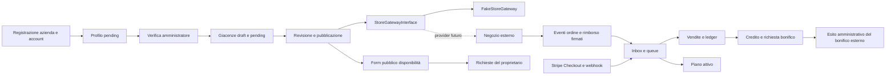

# Preparazione al rilascio — 7 ottobre 2026

## Architettura

Monolite Laravel 13.35, PHP >= 8.4.1, MySQL 8.0.16+/8.4, rendering Blade con Tailwind 4 e Alpine 3, Vite 8. Policies per ruolo/ownership, Form Requests per input, Actions/Services transazionali per dominio, Jobs e scheduler per integrazioni. Denaro in centesimi/basis point e quantità intere in millesimi, mai float. Ledger/audit append-only, lock e unique constraint, inbox/outbox idempotenti. Il negozio è un sistema esterno astratto da StoreGatewayInterface; pagamento PRO e approvazione aziendale restano separati.

## Schema delle funzionalità

L’approvazione mantiene immutata la versione pubblicata finché una modifica non è accettata. Vendite/commissioni conservano snapshot; payout riserva tutto il saldo disponibile, il rigetto lo rilascia. Le richieste pubbliche non prenotano lo stock. Bonifici e checkout prodotti non sono eseguiti dal gestionale; eventi finanziari non aggiornano automaticamente quantità. Impostazioni admin è placeholder, Customer Portal non implementato.

## Modifiche del Prompt 10

- CI GitHub Actions con azioni/digest fissati, permessi minimi, dipendenze dai lockfile, lint completo, build, suite MySQL e SQLite, verifica cache e scheduler. Nessun secret di produzione o job di deploy.
- README riscritto sullo stato applicativo corrente e procedure Linux/cPanel, document root public, permessi, chiave, seed, cache, processi, backup e rollback.
- .env.example ampliato, valori reali assenti; optional null corretti per inizializzare queue/mail, sessioni cifrate e retry_after superiore al lease.
- Requisito Composer PHP allineato a 8.4.1 già imposto dal lockfile; **nessuna versione di dipendenza aggiornata**.
- Formatter corretto nel controller richieste; store:sync, già esistente, aggiunto allo scheduler ogni minuto per recuperare pubblicazioni interrotte. Regole di business invariate.
- Aggiunto DeploymentReadinessTest per bootstrap del template, queue/mail, timeout/lease, storage privato, cifratura e registrazione dei recuperi nello scheduler (2 nuovi test).

## Migration e test

**13 migration**, nessuna nuova in questa fase. Elenco completo e responsabilità in [testing.md](testing.md#migration-in-ordine). Copertura in 21 file PHPUnit: autenticazione, stati/ownership rivenditore, quote FREE/PRO/scambio, giacenze/foto/workflow, richieste/privacy, vendite/rimborsi/idempotenza, wallet/payout/concorrenza, admin, Stripe SDK/webhook mock, FakeStoreGateway, schema/constraint e sicurezza/UX. La suite non richiede servizi di pagamento reali.

## Verifiche della sessione

Verifiche finali completate nel runtime cloud: PHP 8.4.24, Composer 2.8.8, MySQL 8.4.11 e Node 24.19.0. I comandi della CI sono eseguiti localmente in cloud; il workflow remoto GitHub non è stato eseguito o pubblicato da questo task.

| Verifica | Risultato |
| --- | --- |
| composer validate --strict / composer install / check-platform-reqs | Superati |
| vendor/bin/pint --test su tutto il progetto | Superato |
| actionlint 1.7.7, checksum ufficiale verificato | Superato |
| npm ci / npm run build | Superati; asset Vite compilati |
| Suite MySQL | **210 test superati, 984 asserzioni**, inclusa concorrenza |
| Suite SQLite | **204 test superati, 948 asserzioni**, 6 skip specifici MySQL |
| Cache config/route/view e schedule:list isolati | Superati in modalità production; store:sync e integrations:retry ogni minuto, billing:sync ogni ora; design system locale escluso |

PHPStan/Psalm non configurati. Le verifiche UI del Prompt 9 (204 combinazioni Chromium/axe) sono descritte in [audit.md](audit.md), non rieseguite qui perché non sono state modificate viste o interazioni. **npm audit: 0 vulnerabilità**. **Composer audit non completato**: HTTP 403 del feed Packagist nell’ambiente cloud; non è una prova di assenza vulnerabilità PHP e va rieseguito quando il feed è raggiungibile.

## Configurazione necessaria

Inventario completo in [environment.md](environment.md): APP_* (soprattutto URL HTTPS, debug false e chiave privata), DB_*, MAIL_*, STRIPE_* e Price ID, STORE_*, QUEUE_*/INTEGRATIONS_QUEUE_CONNECTION/DB_QUEUE_*, FILESYSTEM_DISK e binario ImageMagick. Configurare anche cache/sessioni/cookie/log, informativa/versione privacy e maturazione del credito. Nessun valore reale è committato nel template; staging e produzione hanno configurazioni distinte.

## Attività esterne prima della produzione

- Provisionare hosting Linux/cPanel compatibile, PHP web/CLI, MySQL/privilegi trigger, storage persistente, ImageMagick, HTTPS/proxy e mail reale.
- Configurare supervisione queue e cron; verificare riavvio, backlog, alert e assenza di dati sensibili nei log.
- Selezionare/implementare e collaudare provider ecommerce: mapping, firma, stock, ordini, tasse/spedizioni/rimborsi e riconciliazione.
- Configurare e provare Stripe in sandbox, poi live: account, prezzi, endpoint, credenziali e decisioni fiscali/commerciali, grace period, downgrade e cancellazione cliente.
- Definire operatività bancaria, maturazione/debiti e informativa/privacy/retention; testare backup/restore DB-upload-chiave e rollback.
- Pubblicare il commit e verificare un run GitHub Actions reale; collaudare device/screen reader e completare [la checklist pre-produzione](pre-production-checklist.md).

**Nessun deployment reale, merge o pubblicazione GitHub eseguito in questa fase.**
